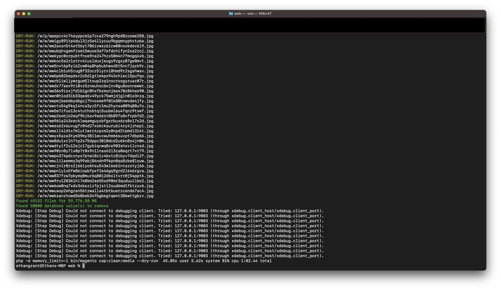
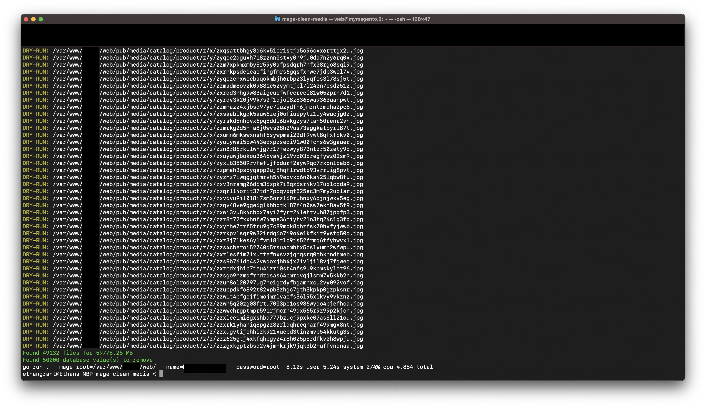
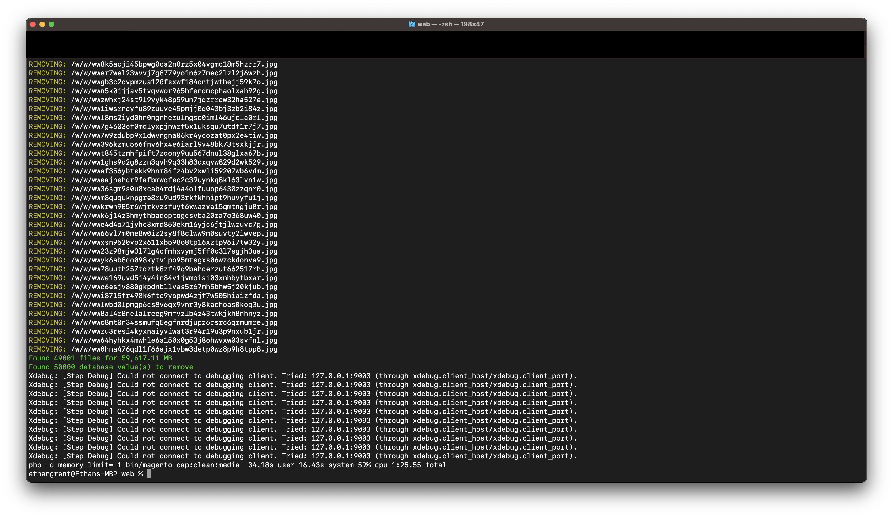

# mage-clean-media

`mage-clean-media` is a Go-based tool inspired by the [CleanMedia](https://github.com/cap340/CleanMedia) project. It is designed to clean up product media files and database records related to products that no longer exist or are redundant in a Magento-based e-commerce platform.

Follows the same logic as [CleanMedia](https://github.com/cap340/CleanMedia), the goal of this project was to just make that process faster and learn some Go in the process.

## Features

- **Media Cleaning**: Detects and removes unused media files associated with deleted products.
- **Database Cleanup**: Removes database records related to non-existent or redundant products.
- **Reporting**: Generates report of the cleaning process for transparency and auditing.
- **No module**: Requires no Magento 2 module installation. GO produces a binary executable that an be run on any system.

### Installation

[Binary download](https://github.com/ethangrant/mage-clean-media/releases)

Download binary via CURL, Linux example

```bash
curl -L https://github.com/ethangrant/mage-clean-media/releases/download/v0.1.1/mage-clean-media_Linux_x86_64.tar.gz | tar -xz
```

### Example

```bash
./mage-clean-media --mage-root=/var/www/magento/web/ --name=heals_staging --password=root --user=root --host=127.0.0.1:40000 --dry-run
```

### Options

- **-dry-run**: Runs the script without deleting files or DB records. (default true)
- **-dummy-data**: Set flag to generate a set of dummy image data.
- **-host string**: Database host (required).
- **-image-count int**: Define the number of images to generate with dummy data option. (default 500)
- **-mage-root string**: Declare the absolute path to the root of your Magento installation.
- **-name string**: Database name (required).
- **-no-cache**: Exclude files from the catalog/product/cache directory. (default true)
- **-password string**: Database password (required).
- **-user string**: Database username (required).
- **-prompt**: Disable prompt during full execution. (default true)

### Dry Run Comparison

**cap340/CleanMedia:**


**mage-clean-media:**


### Full Execution Comparison

**cap340/CleanMedia:**


**mage-clean-media:**


## Generating Dummy Image Data

You can use the `-dummy-data` flag to generate a set of dummy image data.

## Database Configuration

Ensure that the database credentials provided in the command options are correct. The tool requires access to the Magento database to identify and clean up records related to non-existent or redundant products.

## License

This project is licensed under the MIT License. See the [LICENSE](LICENSE) file for more details.

## Acknowledgments

Heavily inspired by [CleanMedia](https://github.com/cap340/CleanMedia). Logic implemented mimics that of the cap340 package.

### Third party libs

- [github.com/fatih/color](https://github.com/fatih/color): Coloured terminal output.
- [github.com/manifoldco/promptui](https://github.com/manifoldco/promptui): CLI prompt
- [github.com/MichaelTJones/walk](https://github.com/MichaelTJones/walk): Parallel file walk.